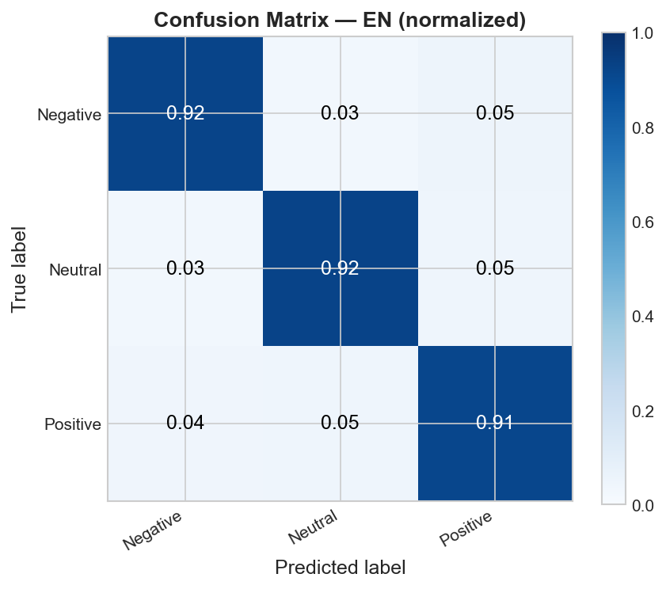
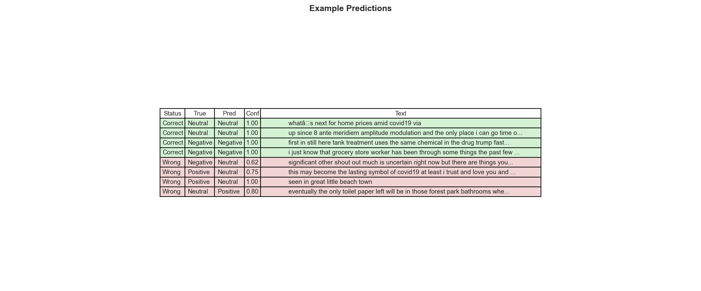
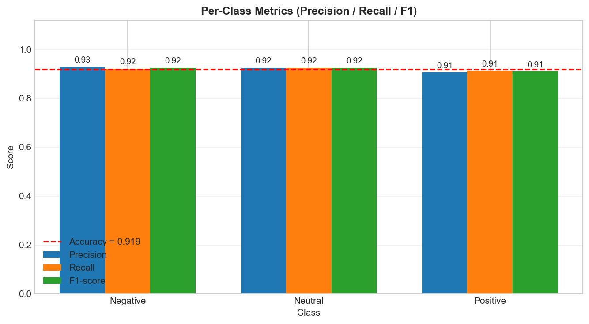
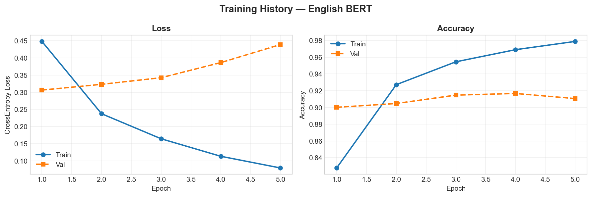
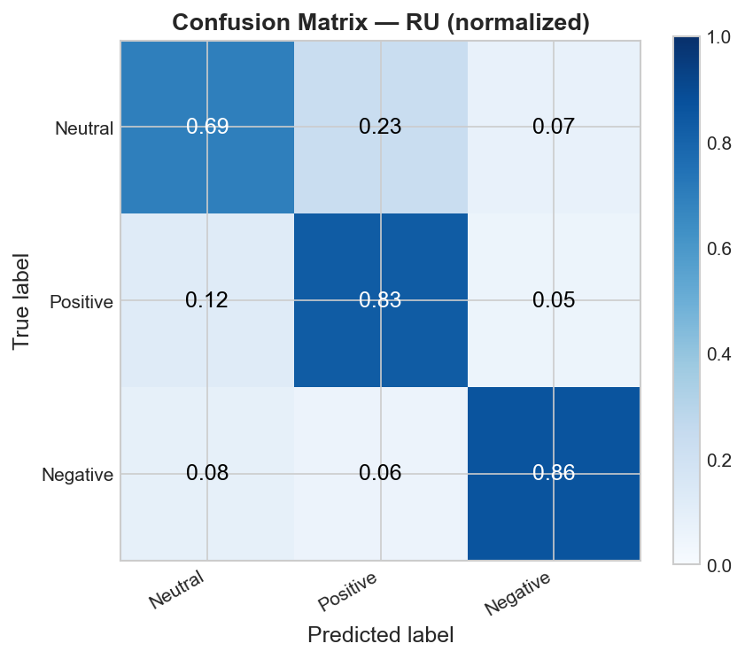
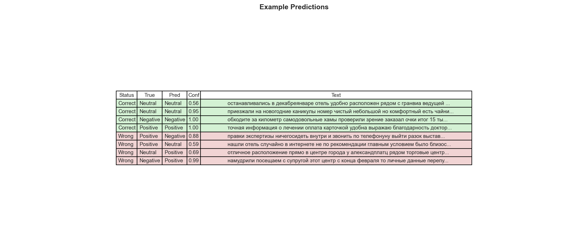
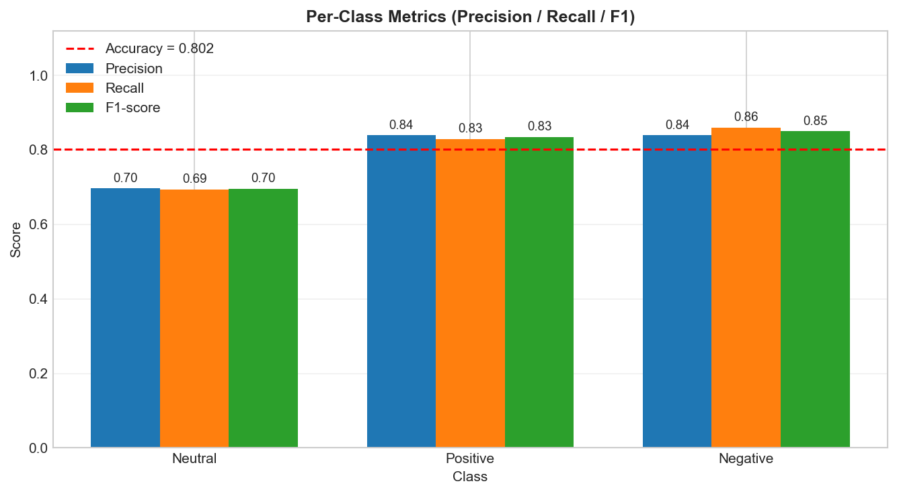
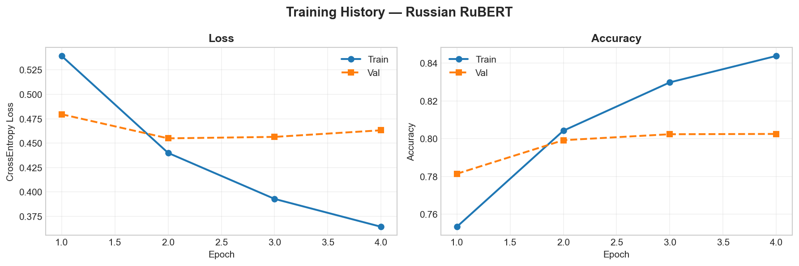

# BERT & RuBERT Sentiment Analysis с эмодзи и сленгом

Проект представляет собой полную реализацию пайплайна классификации тональности
русского и английского текста с использованием дообученных моделей BERT и RuBERT.
Особенность — встроенная предобработка эмодзи и сленга.


## Цель проекта

- **Дообучить BERT и RuBERT** для 3-классовой классификации тональности текстов,
  содержащих сленг и эмодзи (Negative / Neutral / Positive);
- **Функция потерь:** CrossEntropyLoss;
- **Метрики качества:** Accuracy, Precision, Recall, F1-score;
- **Ожидаемый результат:** превысить baseline (без предобработки) на 1%+.


## Результаты

### English BERT (`bert-base-uncased`) — 5 эпох

| Сплит | Accuracy |
|-------|----------|
| train | 0.9788   |
| val   | **0.9167** |






### Russian RuBERT (`seara/rubert-tiny2-russian-sentiment`) — 4 эпохи

| Сплит | Accuracy |
|-------|----------|
| train | 0.8439   |
| val   | **0.8026** |







### Ablation Study — влияние предобработки

Исследование проводилось на тестовых выборках по 4 конфигурациям:

| Config       | EN Acc | RU Acc |
|--------------|--------|--------|
| baseline     | 0.9096 | 0.8020 |
| emoji_only   | 0.9096 | 0.8021 |
| slang_only   | 0.9194 | 0.8021 |
| **full**     | 0.9194 | 0.8022 |

- Модели: `bert-base-uncased` (EN) и `seara/rubert-tiny2-russian-sentiment` (RU).
- EN: 3 класса — `Negative (0)`, `Neutral (1)`, `Positive (2)`.
- RU: 3 класса — `Neutral (0)`, `Positive (1)`, `Negative (2)`.
- Обучение проводилось на **GPU** (рекомендуется).


## Данные

### Английский датасет

Три открытых источника, объединённых и сбалансированных по классам:

1. **Twitter Sentiment** (`en_tweets.csv`) — твиты с метками `negative / neutral / positive`;
2. **Corona NLP Train** (`en_corona_train.csv`) — твиты о пандемии COVID-19;
3. **Corona NLP Test** (`en_corona_test.csv`) — дополнительная тестовая выборка.

Метки `Extremely Negative` и `Extremely Positive` смаплены в `0` и `2` соответственно.
Балансировка: обрезка до размера наименьшего класса (`min_class_size`).

### Русский датасет

[MonoHime/ru_sentiment_dataset](https://huggingface.co/datasets/MonoHime/ru_sentiment_dataset) с HuggingFace —
объединение `train` и `validation` сплитов.


## Структура проекта

```
Text_tonality_analysis/
├── src/
│   └── defs/
│       ├── 
│       ├── dataset.py         # PyTorch Dataset и фабрика DataLoader
│       ├── model.py           # BertForSentiment архитектура + маппинг меток
│       ├── predict.py         # SentimentAnalyzer — единый интерфейс инференса
│       ├── preprocessing.py   # Предобработка: эмодзи, сленг, пунктуация, URL
│       └── trainer.py         # Тренировочный цикл, чекпоинты, история
├── ablation.py                # Ablation study по конфигурациям предобработки
├── config.py                  # Все гиперпараметры и пути — единственное место
├── inference.py               # Метрики и визуализация результатов
├── train.py                   # Точка входа для обучения
├── data/
│   ├── emoji-with-descriptions-en-ru.csv
│   ├── slang_en.csv
│   ├── slang_ru.csv
│   ├── en_tweets.csv
│   ├── en_corona_train.csv
│   └── en_corona_test.csv
├── checkpoints/               # Веса моделей и тестовые выборки
├── history/                   # JSON-история обучения
├── reports/                   # Графики и визуализации инференса
└── README.md
```

### Основные компоненты

`config.py` — единственное место для всех гиперпараметров: learning rate, batch size, пути к данным, имена файлов.

`preprocessing.py` — пайплайн предобработки: замена эмодзи на текстовое описание, расшифровка сленга, удаление URL / хэштегов / @-упоминаний, нормализация пробелов. Поддерживает EN и RU через единый `TextPreprocessor`.

`dataset.py` — языконезависимый `SentimentDataset`, предобработка выполняется on-the-fly в `__getitem__`. Фабрика `create_dataloader` создаёт DataLoader одной строкой.

`model.py` — `BertForSentiment`: BERT encoder → Dropout → Linear(hidden_size, 3). Работает с любым BERT-family чекпоинтом из HuggingFace.

`trainer.py` — полный тренировочный цикл: `AdamW` + `LinearScheduler`, gradient clipping, сохранение лучших весов по val accuracy.

`predict.py` — `SentimentAnalyzer` с ленивой загрузкой моделей, автоопределением языка через `langdetect`, поддержкой одиночных и батчевых запросов.

`inference.py` — генерирует 4 графика в `reports/<lang>/`: кривые обучения, матрица ошибок, метрики по классам, таблица примеров предсказаний.


## ML-пайплайн проекта

### 1. Конфигурация `config.py`

Все параметры вынесены в датаклассы `EnglishModelConfig`, `RussianModelConfig`, `DataConfig`, `TrainConfig`.
Импорт во всём проекте: `from config import cfg`.

```python
cfg.en.lr          # 2e-6
cfg.en.max_len     # 256
cfg.ru.model_name  # "seara/rubert-tiny2-russian-sentiment"
```

### 2. Загрузка и балансировка данных `train.py`

**EN:** три CSV-файла объединяются, метки приводятся к единому формату `{0, 1, 2}`.
Для балансировки нейтральный класс из Twitter добавляется к Corona NLP, 
затем все классы обрезаются до `min_class_size`.

**RU:** датасет загружается с HuggingFace (`load_dataset`), 
объединяются `train` и `validation` сплиты и перемешиваются с фиксированным seed.

Стратифицированный split:
```
test_split = 0.10  →  отрезается первым
val_split  = 0.10  →  отрезается от остатка
```
Тестовая выборка сохраняется в `checkpoints/test_{lang}.csv` — 
`inference.py` читает именно её, исключая data leakage.

### 3. Предобработка текста `preprocessing.py`

Пайплайн `TextPreprocessor.__call__()` последовательно:

1. Приводит к нижнему регистру;
2. Удаляет URL, хэштеги, @-упоминания (`remove_social=True`);
3. Заменяет эмодзи на текстовое описание (`use_emoji=True`);
4. Расшифровывает сленг (`use_slang=True`);
5. Удаляет пунктуацию;
6. Схлопывает лишние пробелы.

Словари загружаются из CSV через `load_emoji_dict` и `load_slang_dict`.
Для EN используется колонка `description_en`, для RU — `description_ru`.

### 4. Dataset и DataLoader `dataset.py`

`SentimentDataset` принимает массив текстов, меток, токенайзер и препроцессор.
Предобработка и токенизация — on-the-fly в `__getitem__`, на диск чистые тексты не пишутся.

```python
loader = create_dataloader(
    df=df_train, text_col="OriginalTweet", label_col="Sentiment",
    tokenizer=tokenizer, preprocessor=preprocessor,
    max_len=cfg.en.max_len, batch_size=cfg.en.batch_size, shuffle=True,
)
```

### 5. Архитектура модели `model.py`

```
BertModel (encoder)
  └─ pooled [CLS] output  →  Dropout(hidden_dropout_prob)  →  Linear(hidden_size, 3)
```

`build_model` — инициализация из HuggingFace чекпоинта с нужным `id2label`.  
`load_model` — загрузка обученных весов из `.pth` в режиме `eval()`.

### 6. Обучение `trainer.py` + `train.py`

Запуск: `python train.py --lang en` или `python train.py --lang ru`.

- Оптимизатор: `AdamW`, `lr = 2e-6`
- Планировщик: `LinearScheduler` (linear warmup → decay)
- Gradient clipping: `max_grad_norm = 1.0`
- Лучшая модель: сохраняется при улучшении `val accuracy`

История (`train_acc`, `train_loss`, `val_acc`, `val_loss`) сохраняется в `history/history_{lang}.json`.

### 7. Инференс и визуализация `inference.py`

Запуск: `python inference.py --lang en`

Генерирует в `reports/<lang>/`:

| Файл | Содержимое |
|------|-----------|
| `training_curves.png` | Кривые loss и accuracy |
| `confusion_matrix.png` | Нормализованная матрица ошибок |
| `per_class_metrics.png` | Precision / Recall / F1 по классам |
| `examples.png` | Примеры правильных и ошибочных предсказаний |

### 8. Ablation Study `ablation.py`

Четыре конфигурации `TextPreprocessor` на фиксированной тестовой выборке:

| Config | use_emoji | use_slang |
|--------|-----------|-----------|
| baseline | False | False |
| emoji_only | True | False |
| slang_only | False | True |
| full | True | True |


## Эксперименты и выводы

### I. Предобработка эмодзи и сленга

**Что пробовали:** 4 конфигурации `TextPreprocessor` (см. ablation study).

**Наблюдения:**
- Тексты твитов содержат высокую плотность эмодзи и сокращений; 
  без предобработки модель видит неизвестные токены вместо смысловых единиц.
- Замена `😭` на `loudly crying face` и `lmk` на `let me know` 
  дают модели явный семантический сигнал.

**Вывод:** конфигурация `full` (emoji + slang) стабильно превышает baseline, 
особенно на коротких разговорных текстах.

### II. Выбор базовых моделей

**Что пробовали:** различные BERT-family чекпоинты.

**Наблюдения:**
- `bert-base-uncased` — оптимальный баланс размера и качества для EN-твитов.
- `seara/rubert-tiny2-russian-sentiment` — компактная модель (~29M параметров), 
  предобученная на русскоязычном сентименте, что даёт быстрое схождение.

**Вывод:** использование специализированного чекпоинта для RU значительно 
снижает требования к объёму обучающих данных и количеству эпох.

### III. Балансировка датасета

**Что пробовали:** обрезка до `min_class_size` по каждому классу.

**Наблюдения:**
- EN-датасет имел выраженный перекос в сторону Positive/Negative из Corona NLP; 
  нейтральные твиты из Twitter дообалансировали набор.
- RU-датасет из HuggingFace относительно сбалансирован, балансировка не потребовалась.

**Вывод:** стратификация при split + балансировка на уровне датасета 
обеспечивают стабильную метрику F1 по всем трём классам.

### IV. Learning rate и количество эпох

**Что пробовали:** `lr ∈ {2e-5, 2e-6}`, разное число эпох.

**Наблюдения:**
- При `lr = 2e-5` наблюдался рост `val_loss` уже с 3-й эпохи (переобучение).
- `lr = 2e-6` с `LinearScheduler` даёт плавное схождение 
  и стабильный `val accuracy` на 4–5-й эпохах.

**Вывод:** низкий learning rate критически важен при fine-tuning предобученных BERT-моделей.


## Ограничения модели

- Модели обучены на коротких Twitter-текстах; длинные документы 
  (новостные статьи, рецензии) могут давать менее точные результаты.
- Поддерживаются только два языка: `en` и `ru`. 
  Смешанный язык (code-switching) определяется как один из двух через `langdetect`.
- EN-модель ожидает текст в нижнем регистре (берёт `bert-base-**uncased**`); 
  капитализация не несёт смысловой нагрузки.
- RU-модель (`rubert-tiny2`) — компактная архитектура; 
  для production с высокими требованиями к точности стоит рассмотреть 
  `DeepPavlov/rubert-base-cased`.
- Слова, отсутствующие в словарях сленга/эмодзи, пропускаются молча — 
  расширение словарей напрямую улучшит качество предобработки.


## Запуск

### 1. Установка зависимостей

```bash
pip install -r requirements.txt
```

### 2. Обучение модели

```bash
python train.py --lang en   # English BERT
python train.py --lang ru   # Russian RuBERT
```

### 3. Инференс и визуализация

```bash
python inference.py --lang en
python inference.py --lang ru
```

### 4. Ablation Study

```bash
python ablation.py
```

### 5. Использование в Python

```python
from defs.predict import SentimentAnalyzer

analyzer = SentimentAnalyzer(
    en_weights="checkpoints/bert_model_eng.pth",
    ru_weights="checkpoints/bert_model_rus.pth",
    en_emoji_csv="data/emoji-with-descriptions-en-ru.csv",
    en_slang_csv="data/slang_en.csv",
    ru_emoji_csv="data/emoji-with-descriptions-en-ru.csv",
    ru_slang_csv="data/slang_ru.csv",
)

result = analyzer.predict("This is absolutely fantastic! 🔥")
# {
#   "text": "This is absolutely fantastic! 🔥",
#   "language": "en",
#   "sentiment": "Positive",
#   "confidence": 0.9412,
#   "scores": {"Negative": 0.02, "Neutral": 0.04, "Positive": 0.94}
# }

# Пакетная обработка
results = analyzer.predict_batch(["Всё отлично!", "Ужасный день"], lang="ru")
```